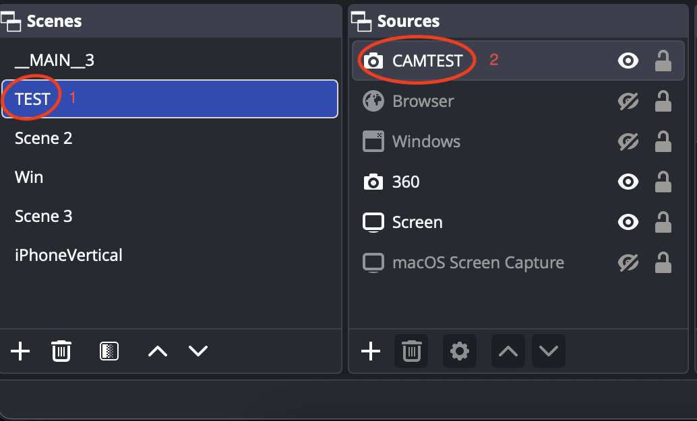
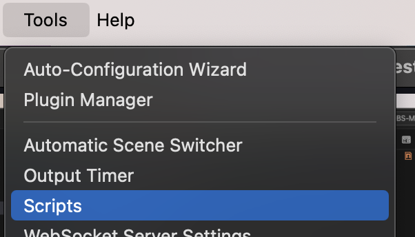
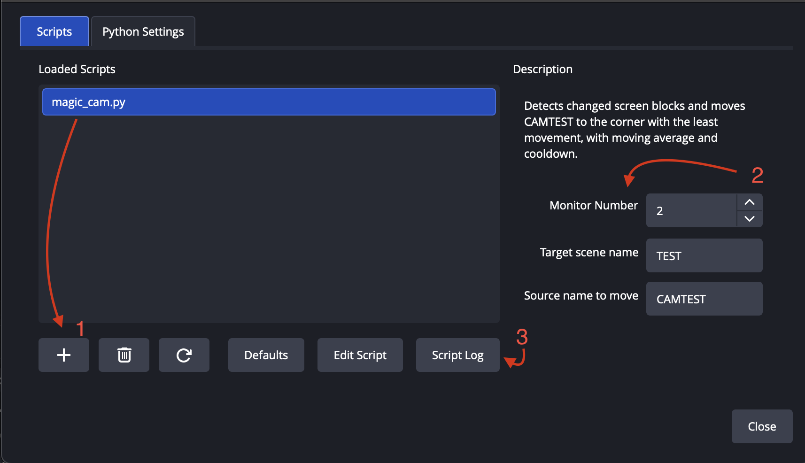
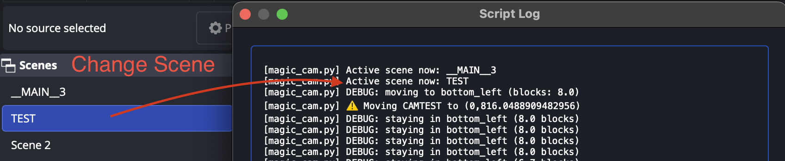

# OBS-MagicCam

Automatically moves your OBS camera to screen areas with the least movement.


---

## Quick Start Guide

### Prerequisites

Before starting, ensure you have:
- **OBS Studio** (v27.0+)
- **Python 3.6+** installed on your system
- **mss library** - Install via terminal:
  ```bash
  pip install mss
  ```

---

### Step 1: Create Scene and Add Camera



1. Create a new scene in OBS Studio
2. Add your camera source to the scene
3. Position and size your camera as desired

---

### Step 2: Open Scripts Menu



Go to **Tools** → **Scripts** in the OBS menu bar

---

### Step 3: Configure the Script



**A. Configure Python (First Time Only)**
1. Click the **Python Settings** tab
2. Set your Python installation path
   - Windows: `C:\Python39` or `C:\Users\YourName\AppData\Local\Programs\Python\Python39`
   - Mac/Linux: `/usr/bin/python3` or `/usr/local/bin/python3`

**B. Add Magic Cam Script**
1. Click the **Scripts** tab
2. Click the **+** button
3. Select `magic_cam.py` from your download location

**C. Configure Settings**
- **Monitor Number**: Monitor to analyze (default: 1)
- **Target Scene Name**: Your scene name (e.g., "Gaming", "TEST")
- **Camera Source Name**: Your camera source name (e.g., "Webcam", "CAMTEST")
- **Block Size**: Analysis precision - 32px recommended (16-128)
- **Movement Threshold**: Sensitivity - 12 recommended (5-50)
- **Stay Threshold**: Stability - 15 recommended (5-50)

**D. View Debug Log**

Click **Script Log** at the bottom to see real-time detection values and camera movements

---

### Step 4: Verify & Test



1. Switch to your configured scene in OBS
2. Check the Script Log - you should see:
   ```
   Active scene now: YourSceneName
   DEBUG: moving to top_left (blocks: 5.2)
   DEBUG: staying in top_left (8.1 blocks)
   ```
3. Move windows or create activity on screen
4. Watch your camera automatically reposition to quiet areas

✅ **Success!** Your camera now intelligently avoids busy screen areas.

---

## Settings Explained

| Setting | Description | Default | Range |
|---------|-------------|---------|-------|
| **Monitor Number** | Which display to monitor | 1 | 1-10 |
| **Target Scene Name** | Scene containing your camera | "TEST" | text |
| **Camera Source Name** | Name of camera source to move | "CAMTEST" | text |
| **Block Size** | Analysis block size (smaller = more precise, higher CPU) | 32px | 16-128 |
| **Movement Threshold** | Min difference to trigger movement (lower = more responsive) | 12 | 5-50 |
| **Stay Threshold** | Movement level to stay still (prevents micro-adjustments) | 15 | 5-50 |

---

## How It Works

1. **Screen Analysis**: Captures your screen every second and divides it into blocks
2. **Corner Detection**: Analyzes movement in 4 corners (top-left, top-right, bottom-left, bottom-right)
3. **Smart Positioning**: Moves camera to the quietest corner
4. **Intelligent Switching**: Stays put if current position is good, but moves if a significantly better corner is available (30% improvement threshold)
5. **Cooldown Protection**: 2-second cooldown prevents excessive movement

---

## Troubleshooting

**❌ Script not loading**
- Verify Python path is correct in Python Settings tab
- Ensure `mss` is installed: `pip install mss`

**❌ Camera not moving**
- Check scene name and camera source name match exactly (case-sensitive)
- Verify you're on the configured scene
- Check Script Log for error messages

**❌ Camera moves too much/too little**
- Adjust **Movement Threshold** (higher = less movement)
- Adjust **Stay Threshold** (higher = more stable)
- Lower **Block Size** for more precision

**❌ High CPU usage**
- Increase **Block Size** (try 48 or 64)
- Check Script Log for errors causing excessive processing

## Configuration

Once the script is loaded, you can configure the following settings in the OBS Scripts window:

### Settings

- **Target Scene Name**: The name of the scene containing your camera source (default: "TEST")
- **Camera Source Name**: The name of your camera source within the scene (default: "CAMTEST")
- **Block Size**: Size of analysis blocks in pixels (default: 100)
  - Smaller values = more precise detection but higher CPU usage
  - Larger values = faster processing but less precise
  - Larger values = faster processing but less precise
- **Movement Threshold**: Minimum difference between corners to trigger movement (default: 15)
  - Higher values = camera moves less frequently
  - Lower values = camera is more responsive to changes
- **Stay Threshold**: Movement level below which camera stays still (default: 20)
  - Prevents unnecessary micro-adjustments

## Usage

### Basic Setup

1. **Create your scene** in OBS with your camera source
2. **Name your camera source** (or use the default "CAMTEST")
3. **Configure the script** with your scene and source names
4. **Switch to your target scene** - the script only runs when the configured scene is active
5. The camera will automatically move to corners with the least movement


### Corner Detection

The script analyzes four corners of your screen:
- **Top Left**
- **Top Right**
- **Bottom Left**
- **Bottom Right**

The camera will position itself in the corner with the least detected movement, ensuring it doesn't cover important content.

## Troubleshooting

### Script Not Working

- Verify Python is correctly configured in OBS
- Check that `mss` is installed in the same Python environment OBS is using
- Ensure the scene name and source name match exactly (case-sensitive)

### Camera Not Moving

- Confirm you're on the correct scene (script only runs on the target scene)
- Check that the movement threshold isn't set too high
- Verify the camera source exists and is visible in the scene

